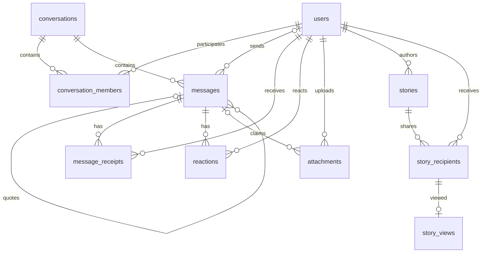

# Architecture and database

This document describes the implemented application. The root [README](README.md) covers setup, assignment coverage, assumptions, and deliverables; [ROUTES.md](ROUTES.md) covers pages, REST endpoints, and socket events.

## Module boundaries

| Location | Responsibility |
| --- | --- |
| `frontend/src/app/` | App Router pages, metadata, public homepage, and shared styles |
| `frontend/src/components/site/` | Public website navigation/footer |
| `frontend/src/components/AppShell.tsx`, `components/shell/` | Messenger composition, navigation, chat list, menus and dialogs |
| `frontend/src/hooks/shell/` | Route selection, list/search derivation, stale-response cancellation, conversation actions |
| `frontend/src/components/chat/` | Header, timeline, composer, message actions, attachments, backgrounds and scroll preservation |
| `frontend/src/components/stories/`, `components/calls/` | Story authoring/viewing and active call window |
| `frontend/src/stores/` | Session, persisted preferences, chat/outbox state, WebRTC lifecycle |
| `frontend/src/lib/api.ts`, `lib/ws.ts` | Typed REST client and reconnecting shared WebSocket |
| `backend/app/api/routes/`, `schemas/` | HTTP transport, input/response validation |
| `backend/app/services/` | Authorization, membership/history visibility, messaging, uploads, contacts, Stories |
| `backend/app/models/`, `db/` | SQLAlchemy models, SQLite configuration, sessions and migration startup |
| `backend/app/ws/` | Socket routing, event validation, presence, typing, call ownership and expiry sweeper |
| `backend/alembic/` | Ordered migrations that preserve existing data |
| `backend/app/seed.py`, `assets/demo_avatars/` | Repeatable empty-database seed and bundled fictional portraits |

UI screens reuse one session/chat store and one WebSocket per browser tab. REST and socket handlers share the same service rules, so a different client cannot bypass group membership, blocks, history boundaries, or media permissions. SQLite uses foreign keys and WAL. Files are stored on disk rather than embedded as database blobs.

## Database schema

`PK` means primary key; `FK` means a database foreign key. User-pair and message/user tables use composite primary keys. Times are stored/read as UTC. Nullable references preserve history when an optional sender/creator/reply disappears. The actual schema is defined in `backend/app/models/` and the checked-in Alembic revisions.

| Table | Keys and important columns |
| --- | --- |
| `users` | `id` PK with SQLite AUTOINCREMENT; unique/indexed `phone`, unique nullable `username`; `display_name`, `about`, `about_emoji`, `avatar_url`, `avatar_color`, read/typing privacy flags, `last_seen_at`, `created_at` |
| `contacts` | `(owner_id, contact_id)` PK, both FK to users; `nickname`, `created_at` |
| `blocks` | `(blocker_id, blocked_id)` PK, both FK to users; `created_at` |
| `conversations` | `id` PK; checked `type` (`direct`, `group`, `note_to_self`); unique nullable `identity_key`; nullable creator FK; group name/description/avatar; disappearing timer; indexed activity time and creation time |
| `conversation_members` | `(conversation_id, user_id)` PK/FKs; checked admin/member `role`; `joined_at`, `left_at`; read cursor, clear-history cursor, pin/archive/mute/unread/hidden state, private `wallpaper` reference |
| `messages` | `id` PK; conversation FK, nullable sender/reply FKs; unique nullable `client_id`; checked text/system `type`; `body`, JSON `meta`, forwarding flag; creation/edit/delete times; disappearing duration/expiry |
| `message_receipts` | `(message_id, user_id)` PK/FKs; `delivered_at`, `read_at`; recipient/read-time index |
| `message_hidden` | `(message_id, user_id)` PK/FKs; per-person delete-for-me visibility |
| `message_mentions` | `(message_id, user_id)` PK/FKs; message mention lookup |
| `reactions` | `(message_id, user_id)` PK/FKs; `emoji`, creation time; one reaction per user/message |
| `attachments` | `id` PK; nullable indexed message FK and uploader FK; `kind`, original filename/MIME, byte size, dimensions/duration, indexed nonunique storage key, creation time |
| `stories` | `id` PK with SQLite AUTOINCREMENT; author FK; checked text/image/video `kind`; body/color and optional media metadata; creation/expiry times |
| `story_recipients` | `(story_id, user_id)` PK/FKs; indexed recipient ID; explicit publication audience |
| `story_views` | `(story_id, user_id)` PK and composite FK to `story_recipients`; first-view time |

Membership's read and clear-history cursors are integer message IDs, not database foreign keys. Services validate that a read cursor belongs to visible history in that conversation. A nullable attachment message reference supports upload-before-send; forwarding creates metadata rows that may share the same storage key.

The diagram emphasizes the core messaging and Story relationships. Contacts/blocks and the remaining message/user join tables follow the composite-key patterns above.



Foreign-key cascades remove dependent join records. Conversation/sender/receipt relationships remain normalized; no duplicated per-user copies of a message are needed. Indexes cover conversation activity, membership lookup, message pagination `(conversation_id, id)`, recipient receipts, attachment storage references, and Story/message expiry.

## Message lifecycle

```mermaid
sequenceDiagram
    participant Sender as Sender browser
    participant API as FastAPI / services
    participant DB as SQLite
    participant Recipient as Recipient browser
    Sender->>Sender: Optimistic sending bubble + client_id
    Sender->>API: message.send (authenticated WebSocket)
    API->>API: Validate membership, blocks and upload ownership
    API->>DB: Insert message and recipient receipts; commit
    API-->>Sender: message.new (persisted ID and client_id)
    Sender->>Sender: Replace optimistic bubble; sent
    API-->>Recipient: message.new
    Recipient->>API: receipt.delivered with received IDs
    API->>DB: Update delivery timestamp
    API-->>Sender: receipt.updated
    Recipient->>API: receipt.read with visible conversation cursor
    API->>DB: Update read state and optional expiry timer
    API-->>Sender: receipt.updated / timer changes
```

REST message creation uses the same service path. Duplicate `client_id` retries return the original authorized message; uniqueness resolves concurrent sends without inserting duplicates. The server claims uploads atomically and validates every forwarding target before creating forwarded messages. Delivery reflects client acknowledgment or visible history fetch, not simply socket connection. Reading also confirms delivery; privacy preferences determine which receipt information other users see.

When a socket reconnects, the client refreshes conversations and loaded history before flushing queued sends. Receipts merge monotonically and repeated events do not duplicate messages. Queues/drafts are memory-resident; a full browser reload does not preserve unsent drafts.

## Access and lifetime rules

- **Group history:** joining/leaving timestamps define a member's visible history. Newly added members cannot access earlier history; former members retain their permitted earlier history and cannot send new messages. Admin operations enforce membership and roles.
- **Local deletion:** message-hidden rows and member clear-history cursors hide messages and their media for that user. Delete-for-everyone updates the shared message. Membership checks also apply to replies, search results, forwarding, and receipt inspection.
- **Media:** attachments require an authorized uploader or permitted conversation history. Story downloads require author/audience access, nonexpired content, and no block in either direction. Uploaded wallpapers belong to a specific conversation member. Profile/group avatars and the fictional demo portrait library are public images.
- **Expiry:** disappearing chat-message timers begin at first read; the sweeper expires messages and their eligible files. Stories expire 24 hours after publication; reads/downloads reject expired content immediately, before physical cleanup.
- **Stories:** publication fixes an explicit individual audience. Composite view-to-recipient foreign keys prevent nonrecipient views. First-view writes are idempotent; the author sees only receipts permitted by the viewer's privacy setting.

## Calls

The existing authenticated socket carries offers, answers and ICE candidates. The backend checks direct-chat membership, blocks, busy state, payload bounds and owning sockets. The first recipient tab to accept owns the call; sibling tabs dismiss their incoming windows. Ringing expires after 45 seconds, and owner disconnects terminate the call.

Browsers exchange media using native WebRTC. Media is not recorded or stored; there is no persisted call-history table. Microphone/camera permissions and localhost/HTTPS are required. Google STUN is the default when ICE settings are absent, empty, or invalid JSON. An authenticated TURN server supplies the fallback media path across restrictive networks; [turn/README.md](turn/README.md) documents the separate Coturn container and tests that force actual media through it. ICE configuration is bundled into the frontend at build time. The client binds asynchronous media/signaling work to a call ID so late work from an ended call cannot consume a newer call's connection candidates.

## Migration and seed decisions

Startup applies Alembic before accepting requests. Fresh databases then seed only if empty. Existing accounts/messages are never reset on restart. Notable data-preserving revisions:

- **Reusable chats:** `identity_key` is `direct:{smaller_user_id}:{larger_user_id}` or `self:{user_id}`. Its unique constraint prevents racing direct/Note-to-Self creation. Legacy duplicates retain history/settings without a reusable identity key.
- **Phone identity:** canonical E.164 phones prevent format variants becoming separate accounts. Legacy duplicate consolidation preserves referenced history; SQLite AUTOINCREMENT prevents retired user IDs being reused by a later registration.
- **Wallpapers:** member-owned settings keep backgrounds private to each participant; the demo phone update preserves Priya's account identity.
- **Demo portraits:** only the nine frozen seed phone/username pairs with missing photos are backfilled. Uploaded photos and other accounts remain unchanged, and later removal/replacement stays persistent.

Docker stores SQLite, uploads and a generated signing secret in one named volume. Local launch scripts use `backend/data/` separately. Run a single backend worker because socket routing, typing, presence and call state are process-local. Multiple workers require a shared coordination/event layer; the current SQLite setup targets the assignment's single-instance application.
