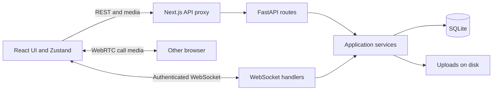

# Signal Clone

A Signal-inspired messenger built for the **Scaler SDE Fullstack Assignment** by **Arpit Walia** ([awalia_be23@thapar.edu](mailto:awalia_be23@thapar.edu)). Next.js/TypeScript, FastAPI, SQLite, and authenticated WebSockets power persistent direct/group chats, contacts, receipts, typing, Stories, and one-to-one voice/video calls.

**Repository:** [Arpit-oo/signal-clone](https://github.com/Arpit-oo/signal-clone). Application code is independently implemented. Phone verification is mocked and messages are stored on the server without end-to-end encryption, as allowed by the brief.

## Quick start: Docker

Requires Docker with Linux containers and Docker Compose v2. From the repository root:

```sh
docker compose up --build -d --wait
```

Open [localhost:3000](http://localhost:3000), choose **Open messenger**, or go directly to [/chats](http://localhost:3000/chats). API documentation: [localhost:8000/docs](http://localhost:8000/docs). Choose a demo account and enter **123456**. Open another browser profile/private window as a second account to test real-time messaging or calling.

```sh
docker compose ps
docker compose logs -f
docker compose down
```

`down` retains the named volume holding SQLite, uploads, and the generated signing secret. Startup applies migrations and seeds only an empty database. Both production containers run as non-root users. Optional ports/environment overrides: [.env.example](.env.example). See [DOCKER.md](DOCKER.md) for configuration, persistence, and troubleshooting.

For calls across networks that cannot connect directly, see the optional [TURN relay setup and forced-relay media checks](turn/README.md). Configuring a local relay does not update the hosted application.

## Local setup

Windows requires Node.js **22.12+**, Python **3.12+**, and `uv`. From your checkout:

```powershell
.\scripts\setup.ps1 -BrowserTests
.\scripts\start.ps1
```

Open **http://127.0.0.1:3000**; the API runs on **8000**. Dependencies, browsers, data, and test artifacts stay inside the checkout. Existing environment files are preserved. Services run in hidden background processes; logs and ownership records are in `.runtime/`.

```powershell
.\scripts\stop.ps1
.\scripts\start.ps1 -Production -FrontendPort 3010
```

Production startup builds the frontend before launching. Stop this project's production services before rebuilding their assets. The stop script checks process ownership and creation time. If PowerShell policy blocks scripts, invoke with `powershell -NoProfile -ExecutionPolicy Bypass -File .\scripts\start.ps1`.

Linux/macOS: start each service in its own terminal:

```sh
cd backend
UV_CACHE_DIR=../.cache/uv uv sync --locked
SEED_ON_STARTUP=true uv run uvicorn app.main:app --host 127.0.0.1 --port 8000 --workers 1
```

```sh
cd frontend
npm ci --cache ../.cache/npm
cp .env.example .env.local
npm run dev
```

[Backend settings](backend/README.md) and [frontend settings](frontend/README.md) explain individual service configuration.

## Demo accounts and signup

All nine accounts use mock OTP **123456**. Names, portraits, messages, and US demo numbers are fictional seed data; phone ownership is never verified.

| Name | Phone | Username |
| --- | --- | --- |
| Alex Rivera | +15550000001 | alex |
| Priya Sharma | +919876540102 | priya |
| Marcus Chen | +15550000003 | marcus |
| Sofia Rossi | +15550000004 | sofia |
| Liam O'Connor | +15550000005 | liam |
| Aisha Khan | +15550000006 | aisha |
| Daniel Kim | +15550000007 | daniel |
| Emma Novak | +15550000008 | emma |
| Rahul Mehta | +15550000009 | rahul |

Seeding supplies direct chats, two groups, Note to Self, message history, replies, reactions, sample attachments, and unread/archive/pin state. Each user has a bundled portrait. A one-time migration fills missing demo photos while preserving uploaded photos and other accounts; subsequent photo removal/replacement persists.

Register at `/signup` with your phone/country code, mock verification, display name, optional username, and photo. New accounts start with Note to Self and their own empty contacts/history. Add registered people from **New conversation** by name, exact phone, or username. Canonical E.164 phone identity prevents repeated verification from creating duplicate accounts. The country-code field defaults to +91; full international numbers keep their explicit code.

## Assignment coverage

This table follows the supplied **Secure Messaging Platform (Signal Clone) - SDE Fullstack Assignment** TXT brief.

| Brief requirement | Implemented behavior |
| --- | --- |
| Required stack | Next.js/TypeScript, Python/FastAPI, SQLite, WebSockets |
| Authentication/onboarding | Mock phone OTP, display name/avatar, optional username, login/logout, session persistence |
| Contacts/conversation list | Add contacts/nicknames, recent-activity sorting, contact/chat search, previews, unread state, online/last-seen |
| One-to-one messaging | Persistent text, timestamps, sending/sent/delivered/read states, receipts, typing, retry/reconnect recovery |
| Groups | Create/name/photo/description, message history, member list, admin-managed members and roles |
| Signal experience | List/chat-pane layout, bubbles/replies, menus/forms/dialogs, filters/search, notifications/toasts, fullscreen settings |
| Sample data | Nine users/photos, direct and group conversations, messages, attachments, replies, reactions |
| Optional bonuses | Image/file/video/audio/voice attachments, emoji reactions, quoted replies, disappearing messages, dark mode, responsive layouts, keyboard controls |
| Calls/Stories: placeholders permitted | Functional one-to-one WebRTC voice/video; text/photo/video Stories with explicit audience and 24-hour expiry |
| Linked devices/encryption: placeholders permitted | Linked devices placeholder; simulated privacy UI with server-stored contents |
| Documentation | Setup, stack, architecture, schema, assumptions, and API overview included |

Pins appear ahead of activity-sorted chats. Pin/archive/mute/unread preferences and backgrounds belong to each conversation member. Group admins manage members and roles. On phones, press and hold for actions; on desktop, right-click or use hover buttons. Tab, Shift+F10, and Escape support keyboard use. Motion respects reduced-motion preferences. Inter remains the application font.

## Tech stack and architecture

| Layer | Technology |
| --- | --- |
| Frontend | Next.js 16, React 19, TypeScript, Tailwind/shared CSS, Zustand, Radix menus |
| Backend | Python 3.12+, FastAPI, Pydantic, async SQLAlchemy, Alembic |
| Persistence | SQLite with foreign keys/WAL; uploads on disk/persistent Docker volume |
| Real time | JSON WebSockets; native WebRTC for call media |
| Checks | Ruff, pytest, ESLint, TypeScript, Vitest, Playwright Chromium |
| Packaging | Locked npm/uv dependencies; multi-stage Docker images |

The browser sends REST/media through Next.js's `/api/*` proxy and connects directly to FastAPI for WebSockets. Each signed-in tab owns one socket. Routes delegate to services that enforce membership, privacy, and transaction rules. SQLite persists messaging data; socket/typing/presence/call state lives in the single backend process.



[ARCHITECTURE.md](ARCHITECTURE.md) documents module boundaries, database relationships, the message sequence, access rules, and migration decisions.

## Database schema

The application has **14 tables**, plus Alembic bookkeeping. Detailed columns and the relationship diagram are in [ARCHITECTURE.md](ARCHITECTURE.md#database-schema).

| Table | Key and purpose |
| --- | --- |
| `users` | User ID; unique canonical phone/optional username; profile/privacy/last-seen |
| `contacts`, `blocks` | Composite user-pair keys; nicknames and blocking |
| `conversations` | Chat ID; type, group metadata, timer, activity, unique reusable direct/self identity |
| `conversation_members` | Composite chat/user key; role, history boundaries, read cursor, personal settings |
| `messages` | Message ID; conversation/sender/reply references, unique client ID, timestamps/expiry |
| `message_receipts`, `message_hidden`, `message_mentions`, `reactions` | Composite message/user keys; receipts, local deletion, mentions, one reaction per person |
| `attachments` | File ID; uploader, optional message, metadata/storage key |
| `stories` | Story ID; author, text/media/expiry |
| `story_recipients`, `story_views` | Composite story/user keys; explicit audience and permitted first views |

## API overview

Protected REST endpoints require `Authorization: Bearer {token}`. Attachment, Story, and wallpaper media also accept `?token={token}` for media elements. Public avatars are separate. `/docs`, `/redoc`, and `/openapi.json` describe request/response schemas. [ROUTES.md](ROUTES.md) lists every endpoint and frontend route.

| Method | Path | Purpose |
| --- | --- | --- |
| POST | `/api/auth/request-otp`, `/api/auth/verify` | Mock verification and session creation |
| GET/PATCH | `/api/me` | Profile and privacy settings |
| GET | `/api/users/search`, `/api/users/lookup` | Find registered people |
| GET/POST | `/api/contacts` | List/add contacts |
| GET/POST | `/api/conversations` | List/create direct/group chats |
| GET/PATCH/DELETE | `/api/conversations/{id}` | Details, metadata, or member-local deletion |
| POST | `/api/conversations/{id}/members` | Add group members |
| PATCH/DELETE | `/api/conversations/{id}/members/{user_id}` | Change role/remove member |
| PATCH | `/api/conversations/{id}/settings` | Personal chat/background settings |
| GET/POST | `/api/conversations/{id}/messages` | History or message send |
| POST | `/api/messages/delivered`, `/api/conversations/{id}/read` | Delivery/read acknowledgments |
| PATCH/DELETE | `/api/messages/{id}` | Edit/delete |
| PUT/DELETE | `/api/messages/{id}/reaction` | Set/remove reaction |
| POST | `/api/attachments` | Upload a file for sending |
| GET/POST | `/api/stories` | Feed or story creation |
| DELETE | `/api/stories/{id}` | Author deletion |
| POST/GET | `/api/stories/{id}/views` | Record/view privacy-permitted receipts |
| GET | `/health` | Readiness |

Authenticate with `POST /api/auth/verify` and `{"phone":"+15550000001","code":"123456"}`. Use its token to list `/api/conversations`, then send to an authorized conversation:

```http
POST /api/conversations/12/messages
Authorization: Bearer {token}
Content-Type: application/json

{"client_id":"unique-client-message-id","body":"Hello!"}
```

`client_id` makes retries idempotent for the same sender/conversation. Replies add `reply_to_id`; files add `attachment_ids`. History supports `before`, `after`, and `around` IDs.

Connect a WebSocket to the API host's `/ws?token={token}` using `{type, data}` frames:

```json
{"type":"message.send","data":{"conversation_id":12,"client_id":"unique-client-message-id","body":"Hello!"}}
```

`message.new` acknowledges the sender and notifies recipients. Clients explicitly acknowledge received IDs and visible read history; opening a socket alone does not mark delivery. Typing, presence, receipts, reactions, Stories refreshes, and call signaling share the connection. REST errors use `detail`; rejected socket events return `error`. See [WebSocket events](ROUTES.md#websocket-events).

## Verification

After setup, stop local production services before running the full check script:

```powershell
.\scripts\stop.ps1
.\scripts\verify.ps1 -BrowserTests
.\scripts\start.ps1 -Production -FrontendPort 3010
```

This runs Ruff/pytest, ESLint/TypeScript, Vitest, a production build, and Playwright. Browser tests use isolated servers on **8001/3001**, their own database, and `.next-e2e` output; they preserve user data. Those ports must be free. On Linux/macOS, install Chromium from `frontend/` with `PLAYWRIGHT_BROWSERS_PATH=../.cache/playwright npx playwright install chromium`, then run the service checks:

```sh
# backend/
uv run --locked ruff check .
uv run --locked pytest -q
# frontend/
npm run lint
npm run typecheck
npm test
npm run build
npm run test:e2e
npm audit --omit=dev
```

Tests cover phone identity, group permissions/history, retries, uploads/media authorization, receipts, migration/seed preservation, Stories, calls, backgrounds, reconnect state, routes, and responsive interactions. The full dependency audit has a development-only [braces advisory](https://github.com/advisories/GHSA-vfj7-8cjw-p6xm) through Next's matching ESLint tooling; production dependencies are checked separately.

Final local validation on **2026-10-09**:

| Check | Result |
| --- | --- |
| Backend Ruff / pytest | Clean; 130 passed, one POSIX-only permission test skipped on Windows |
| Frontend ESLint / TypeScript / Vitest | Clean; 40 unit tests passed |
| Playwright Chromium | 29 passed, including real voice/video media and own-number registration/messaging |
| Native and Docker production builds | Passed |
| Production npm dependency audit | Zero vulnerabilities reported |
| Existing database after restart | Integrity/foreign keys valid; user, conversation, message, contact and Story counts preserved |
| Demo avatars and responsive UI | All nine images load through native and Docker frontends; no mobile overflow or page errors in the portrait check |

## Assumptions and limits

- **Authentication:** fixed OTP, no SMS/email or ownership verification. JWT sessions last 30 days; logout removes the local token. Phone signup satisfies the brief's phone-or-username requirement; usernames are optional discovery identifiers.
- **Encryption:** actual Signal Protocol/key exchange is outside scope. Messages/files are server-stored; the assignment allows simulation. Homepage claims describe the official Signal product.
- **Calling:** one-to-one voice/video with accept/decline, mute, camera, busy/offline feedback, hangup and cleanup. Media needs localhost/HTTPS and browser permission. Google STUN servers are the default when ICE settings are absent, empty, or invalid JSON; restrictive networks require an authenticated TURN relay via `NEXT_PUBLIC_RTC_ICE_SERVERS`. The optional [Coturn setup](turn/README.md) includes voice/video checks forced through UDP/TCP relay paths. Calls are ephemeral; group calls and linked devices are placeholders.
- **Stories:** selected-individual audience, 24-hour expiry, privacy-aware views, author deletion. Group distribution/drawing/sticker creation are outside scope. Story expiry starts at publication; disappearing chat messages start their timer at first read.
- **Runtime:** one backend worker. Multi-worker scaling needs shared socket/event/state infrastructure. SQLite and uploads require persistent storage.
- **Client state:** session/preferences survive reloads. Drafts, queued sends, and upload previews are memory-resident; full reload clears them. An open tab reconnects, refreshes missed history, and retries queued sends.
- **Notifications:** in-app toasts; background notifications require browser permission. Attachments, Stories, and uploaded backgrounds follow server-side permissions.

## Submission deliverables

| Brief deliverable | Location / status |
| --- | --- |
| Public repository containing `frontend/` and `backend/` | [Arpit-oo/signal-clone](https://github.com/Arpit-oo/signal-clone) |
| README: setup, stack, architecture, schema, assumptions, API overview | This README, [ARCHITECTURE.md](ARCHITECTURE.md), [ROUTES.md](ROUTES.md), service guides |
| Hosted working demo | **Final release deployment pending by request.** The locally verified release has not been deployed. |
| Submit GitHub and deployed application links | Repository is ready; confirm/update the hosted link after final deployment. |

Earlier preview links: [application](https://signal-clone-ochre-one.vercel.app), [API docs](https://signal-clone-api-bnvj.onrender.com/docs). They do not verify this final source revision. The earlier free service uses ephemeral storage, so data is not guaranteed across restarts. `frontend/vercel.json` disables Git-triggered deployment, and `render.yaml` uses manual deployment; see [Vercel's controls](https://vercel.com/docs/project-configuration/git-configuration) and [Render's controls](https://render.com/docs/deploys). This source review does not deploy.

## Attribution and repository contents

Signal's name/logo/reference artwork/homepage copy belong to their respective owners. This independent recreation is not affiliated with Signal. [Reference attribution](frontend/public/signal/README.md), [Inter's license](frontend/public/signal/Inter-LICENSE.txt), and [fictional portrait provenance/prompts](backend/app/assets/demo_avatars/README.md) are included. Fonts, portraits, and artwork are local; no image/font service is needed. Official Signal repositories were consulted for design/interaction reference; application code was written independently.

`frontend/src/` contains pages/components/hooks/stores; `backend/app/` contains routes/services/models/realtime; `backend/alembic/` contains migrations; service `tests/` contain regression checks. Environment secrets, databases, uploads, installed dependencies, caches, screenshots, logs, and test reports are excluded from Git.
